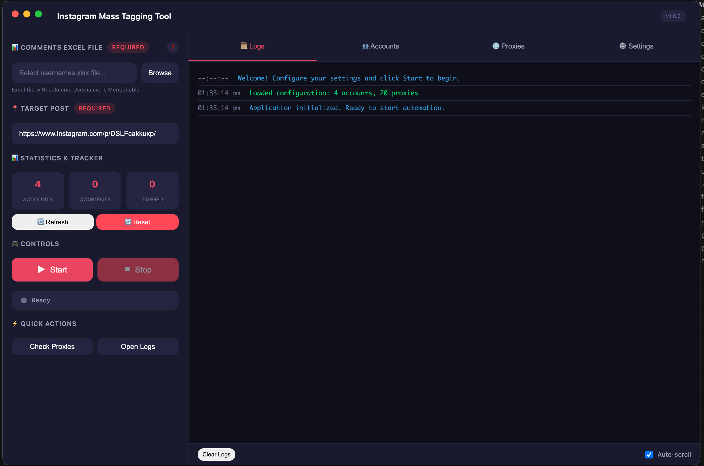
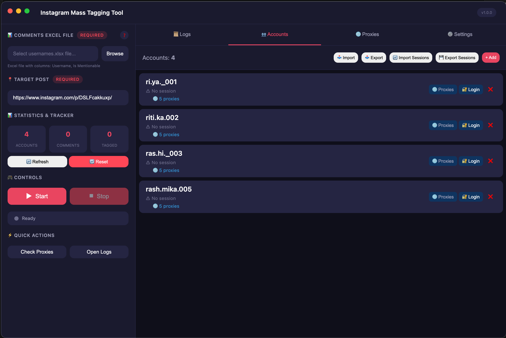
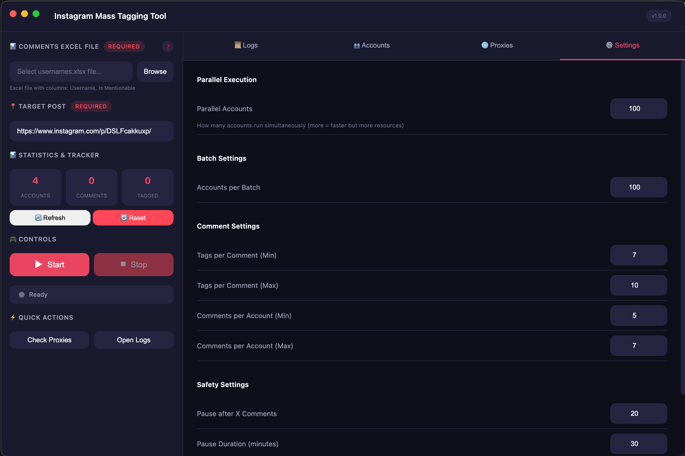
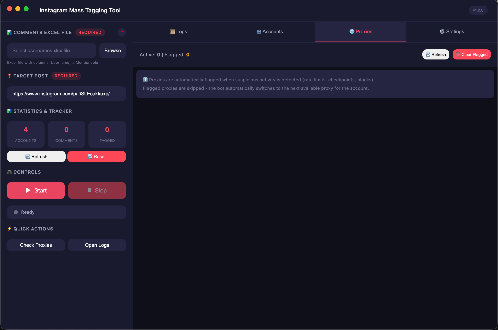

# 🚀 Instagram Mass Tagging & Auto Comment Tool

[](https://electronjs.org/)
[](https://nodejs.org/)
[](https://pptr.dev/)
[](LICENSE)

**Educational Tool** – This repository demonstrates how to automate Instagram commenting and mass‑tagging safely using Electron and Puppeteer. It is intended for learning automation techniques, understanding Instagram’s safety limits, and exploring best practices for responsible social‑media engagement.

> **Keywords:** Instagram automation, mass tagging tool, auto comment Instagram, Instagram bot, safe tagging, bulk commenting, Instagram engagement, multi‑account management, proxy support, anti‑detection, educational example

---

## 📋 Table of Contents

- [Features](#-features)
- [Video Demo](#-video-demo)
- [Screenshots](#-screenshots)
- [Installation](#-installation)
- [Quick Start](#-quick-start)
- [Usage Examples](#-usage-examples)
- [Safety & Fair Use](#-safety--fair-use)
- [Statistics & Performance](#-statistics--performance)
- [Configuration](#-configuration)
- [Troubleshooting](#-troubleshooting)
- [Documentation](#-documentation)
- [Contributing](#-contributing)
- [License](#-license)
- [Author](#-author)
- [Disclaimer](#-disclaimer)

---

## ✨ Features

- **Desktop GUI** built with Electron – modern dark theme, real‑time stats, live log viewer
- **CLI mode** for headless automation
- **Multi‑account support** – handle 500‑700+ accounts concurrently
- **Batch processing** – configurable accounts per batch to respect Instagram rate limits
- **Smart tag distribution** – 60 unique tags per account across 5‑7 comments
- **Global Tag Tracker** – prevents duplicate tagging across parallel accounts
- **Proxy rotation** – HTTP / SOCKS5 support with authentication
- **Human‑like behavior** – random delays, typing simulation, scrolling, user‑agent rotation
- **Safety limits** – random comment delays (35‑120 s), session caps (5‑15 min), long pauses after 50 comments
- **Comprehensive logging** – CSV logs, JSON session summaries, Excel username import

---

## 🎥 Video Demo

A step‑by‑step walkthrough (setup, configuration, and live run) is available here:

**[Instagram Mass Tagging Tool – Demo (YouTube)](https://www.youtube.com/watch?v=PLACEHOLDER)** *(link to be replaced with actual video)*

---

## � Screenshots

| Main Screen | Account Screen |
|:-----------:|:--------------:|
|  |  |

| Settings Screen | Proxy Screen |
|:---------------:|:------------:|
|  |  |

---

## �🛠️ Installation

### Prerequisites
- **Node.js** ≥ 16
- **npm** or **pnpm**
- macOS / Windows / Linux

```bash
# Clone the repository
git clone https://github.com/yourusername/instagram-mass-tagger.git
cd instagram-mass-tagger

# Install dependencies
npm install   # or: pnpm install

# Install the bundled Chromium for Puppeteer (if not present)
npm run browser
```

### Build the Desktop App (optional)
```bash
npm run build:mac    # macOS DMG
npm run build:win    # Windows EXE/NSIS
npm run build:linux  # Linux AppImage / DEB
```

---

## 🚀 Quick Start

1. **Configure accounts & proxies** – edit `config/accounts.json` (see the [Configuration](#-configuration) section).
2. **Prepare usernames** – place an Excel file `data/usernames.xlsx` with columns `Username` and `Is Mentionable` (TRUE/FALSE).
3. **Run the GUI** – `npm run electron` and follow the on‑screen steps.
4. **Or run headless** – `npm start` (or `node main.js`).

---

## 📖 Usage Examples

### Desktop GUI (recommended)
```bash
npm run electron
```
- Load accounts
- Import the Excel list
- Set the target post URL
- Click **Start Tagging**

### CLI Automation
```bash
# Verify proxies first
npm run proxy-check

# Start tagging
npm start
```

### Advanced Example (custom batch size & delay)
```json
"settings": {
  "accountsPerBatch": 75,
  "tagsPerComment": {"min": 10, "max": 12},
  "commentsPerAccount": {"min": 5, "max": 7},
  "pauseAfterComments": 60,
  "sessionTimeoutMinutes": 12
}
```

---

## ⚖️ Safety & Fair Use

**Educational Intent** – This project showcases automation techniques; it is **not** intended for illicit mass‑spam activities. Use it responsibly and always respect Instagram’s Terms of Service.

### Responsible Usage Guidelines
- **Community Engagement** – Tag participants in contests or collaborations *with permission*.
- **Brand Partnerships** – Tag partners in promotional posts.
- **Event Promotion** – Tag attendees for event‑related content.
- **Learning Projects** – Demonstrate automation in a controlled environment.

### Prohibited Uses
- Unsolicited spamming of unrelated users
- Harassment or unwanted tagging
- Automated purchase of engagement
- Any activity that violates Instagram’s Community Guidelines

### Daily Safety Limits (recommended)
| Account tier | Tags / day | Comments / day | Session time |
|--------------|-----------|----------------|--------------|
| New | 20‑30 | 2‑3 | 5‑10 min |
| Established | 50‑60 | 5‑7 | 10‑15 min |
| Trusted | 60‑80 | 6‑8 | 15‑20 min |

---

## 📊 Statistics & Performance

### Sample Metrics (100 accounts, 1 batch)
- **Total tags/day:** 6 000
- **Total comments/day:** ≈ 600
- **Processing time:** 8‑25 h (depends on system & proxy speed)
- **Success rate:** 95‑98 %

### Real‑time Dashboard (GUI)
- Unique users tagged
- Tags attempted vs. duplicates prevented
- Current session speed and ETA

---

## ⚙️ Configuration

The central file is `config/accounts.json`:
```json
{
  "accounts": [
    {
      "username": "account1",
      "password": "pass1",
      "proxy": {"protocol":"http","address":"proxy.example.com","port":8080,"username":"u","password":"p"}
    }
  ],
  "proxies": [
    {"protocol":"http","address":"142.111.48.253","port":7030,"username":"global","password":"globalpass"}
  ],
  "targetPost": "https://www.instagram.com/reel/YOUR_REEL_ID/",
  "settings": {
    "accountsPerBatch": 100,
    "tagsPerComment": {"min":10,"max":12},
    "commentsPerAccount": {"min":5,"max":7},
    "pauseAfterComments": 50,
    "sessionTimeoutMinutes": 15
  }
}
```
- **Accounts** – individual credentials, optional per‑account proxy or proxy array.
- **Global proxies** – fallback pool if accounts have none.
- **TargetPost** – Instagram reel/post URL to tag.
- **Settings** – batch size, tag limits, pauses, and session timeout.

See the full reference in `docs/api.md`.

---

## 🐛 Troubleshooting

- **Action Blocked** – increase delays, reduce batch size, or rotate proxies.
- **Checkpoint Required** – run `node manual-login/manual-login.js` to complete verification manually.
- **Login Failures** – double‑check credentials, test proxy with `npm run proxy-check`.
- **Proxy Issues** – ensure proxy protocol matches configuration, verify credentials.
- **Performance Slowness** – lower `accountsPerBatch` or upgrade hardware.

Full guide: `docs/troubleshooting.md`

---

## 📚 Documentation

Additional docs reside in the **docs/** folder:
- **[API Reference](docs/api.md)** – core classes and methods.
- **[Proxy Setup Guide](docs/proxy-setup.md)** – detailed proxy configuration.
- **[Tag Tracker Guide](docs/tag-tracker.md)** – duplicate prevention system.
- **[Troubleshooting](docs/troubleshooting.md)** – common issues and fixes.
- **[Changelog](docs/changelog.md)** – version history.

---

## 🤝 Contributing

Contributions are welcome! Please read the `CONTRIBUTING.md` guidelines before submitting a pull request.

1. Fork the repo
2. Create a feature branch
3. Make changes & add tests if applicable
4. Submit a PR

---

## 📄 License

Distributed under the **ISC License** – see the [LICENSE](LICENSE) file for details.

---

## 👨‍💻 Author

**Tanishk Dhaka** – Developer & Automation Specialist
- 📍 Delhi, India
- 🔗 [GitHub](https://github.com/yourusername)
- 📧 your.email@example.com

---

## ⚠️ Disclaimer

**Educational Purpose Only** – This repository is provided **strictly for educational purposes** to illustrate automation concepts and safe‑usage patterns. Users must comply with Instagram’s Terms of Service and any applicable laws. The author assumes no liability for misuse or violations.

---

*Last updated: 2026‑05‑03*